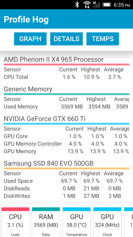
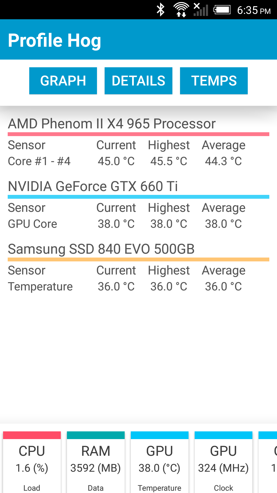

# ProfileHog

### Summary
Profile Hog is a second screen Andriod app that leverages the [Open Hardware Monitor](http://openhardwaremonitor.org/) libraies to display computer resource utilization and component teperature information on your phone.  Running in a server-client configuration Profile Hog will gather resource and component information then send it to your Android device over a local wireless network.

**Note:** This software is in the early stages of development. The code might be hard to understand and some design patterns weren't followed.  This is will be addressed in later releases, right now I'm focused on testing the cocept and familirizing myself with [Xamarin](https://xamarin.com/).

### Getting Started
###### Connecting
To initiate a connection simply ensure your computer is on the same network as your Andriod device and start both the Andriod and Windows application. Using a UDP broadcast the two devices will locate eachother and begin tranmitting data.

###### The Interface

| Utilization Details | Temperature Details |
| ------------- | ----------- |
|  |  |

