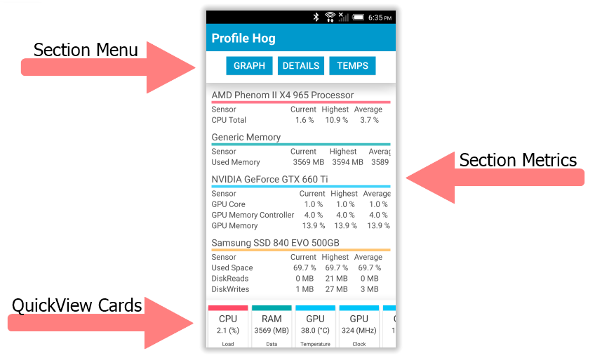

# ProfileHog

### Summary
Profile Hog is a second screen Andriod app that leverages the [Open Hardware Monitor](http://openhardwaremonitor.org/) libraies to display computer resource utilization and component teperature information on your phone.  Running in a server-client configuration Profile Hog will gather resource and component information then send it to your Android device over a local wireless network.

**Note:** This software is in the early stages of development. The code might be hard to understand and some design patterns weren't followed.  This is will be addressed in later releases, right now I'm focused on testing the cocept and familirizing myself with [Xamarin](https://xamarin.com/).

### Getting Started
###### Connecting
To initiate a connection simply ensure your computer is on the same network as your Andriod device and start both the Andriod and Windows application. Using a UDP broadcast the two devices will locate eachother and begin tranmitting data.

###### The Interface
The interface is broken up into 3 sections, ***Section Menu***, ***Section Metrics***, and ***QuickView Cards***. 

* The *Section Menu* contains links for the 3 different views offered by ProfileHog.
* Values for current, average, and high metrics of the selected view will be shown here.
* QuickView Cards display a user defined list of metrics at the bottom of every section.  This is designed to act as a way to allow the user to view component temperature while keeping an eye on CPU utilization.

| Anatomy of ProfileHog |
| ------------- |
|  |

### ProfileHog Overhead
ProfileHog is light.  It should generally consume less than 30MB of ram and for the most part leave your CPU alone.  If you experience resource utilization above what I have outlined please let me know.  I have a limited number of system to test this application on and any input would be greatly appriciated.

###### Windows Task Manager

###### Visual Studios Profiler Output

### Moving Forward
As stated in the note below the summary I have every intention of rebuilding Profile Hog. In doing so I will include lessons learned as well as any feedback about the current iteration.  I'll also read a style guide. *I promise*.

